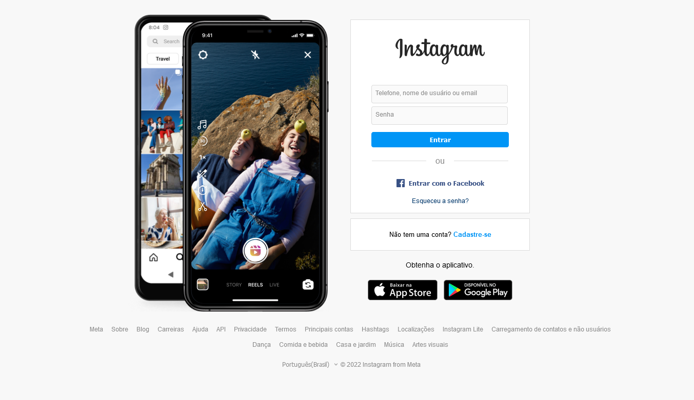
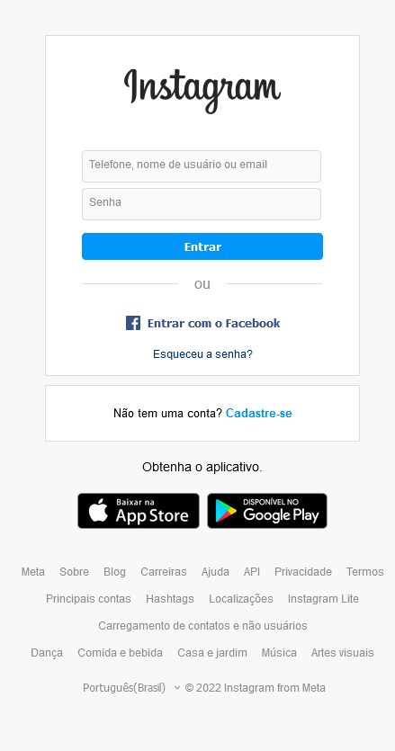

# Clone do Instagram
## Resumo

Interface criada com o intuito de praticar os assuntos propostos no bootcamp da dio no módulo sobre html e css.

## Imagens 

## Tecnologias usadas
- HTML
- CSS
- JavaScript 